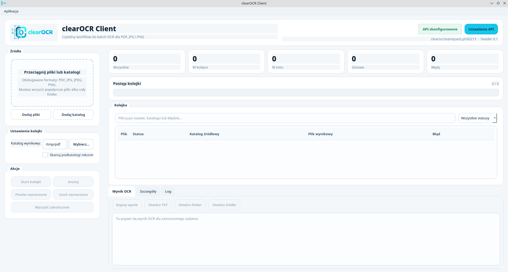

# 🚀 clearOCR Client

Extract clean, well-ordered text from PDFs and images using the **clearOCR API**.

Desktop application with batch processing, PDF chunking and optional barcode detection.

---

## ✨ Features

* 🔑 API key authentication
* 📂 Batch OCR for files and folders
* 📄 PDF support with automatic chunking (**pypdf**, no system dependencies)
* 🔍 Optional barcode detection
* 🧾 Clean text output with proper reading order
* 📑 Optional page markers in TXT output (`--- PAGE N ---`)
* 🌍 Automatic UI language detection:

  * Polish 🇵🇱 if system language starts with `pl`
  * English 🇬🇧 otherwise
* ⚙️ Local settings (stored on user's machine)

---

## 🎁 Free Tier

New users receive:

* **1,000 free OCR runs**
* valid for **30 days**

👉 To get started:

* create an account at **https://clearocr.com**
* generate your **API key**
* use it in the application

---

## 📸 Screenshot



---

## ⚡ Quick Start

1. Run the application:

```bash
clearocr-app
```

2. Enter your API key
3. Click **Run OCR**

---

## ⚙️ API Configuration

The client is preconfigured to work with the clearOCR API:

```
https://clearocr.teamquest.pl:60213/extract-document-parser
```

You only need to provide:

* **API KEY**

No username or additional setup required.

---

## 📄 Output

* Output is saved as `.txt`
* Optional page separators:

```
--- PAGE 1 ---
```

* Barcode results (if enabled) are appended at the end:

```
--- BARCODES ---
```

---

## 🧠 How it works

* Files are sent to the clearOCR API
* Large PDFs are automatically split into chunks
* Results are merged into a single clean text output
* Temporary files are removed after processing

---

## 📊 OCR Benchmarks (Polish documents)

Performance benchmarks on real-world Polish documents are available here:

👉 https://huggingface.co/collections/Lukaszl/polish-ocr-benchmarks-results

These benchmarks focus on:

* government documents
* insurance/legal texts
* newspapers
* complex layouts

---

## ⚠️ Disclaimer

This application is provided **"AS IS"**, without any guarantees or support.

* No technical support is provided for this client
* Use at your own risk
* For production use, rely on the **clearOCR API directly**

---

## ⚠️ Requirements

* Python **3.10+**
* No external system dependencies (uses `pypdf`)

---

## 🛠 Development

Build package:

```bash
pip install build
python -m build
```

---

## 📜 License

Apache License 2.0
